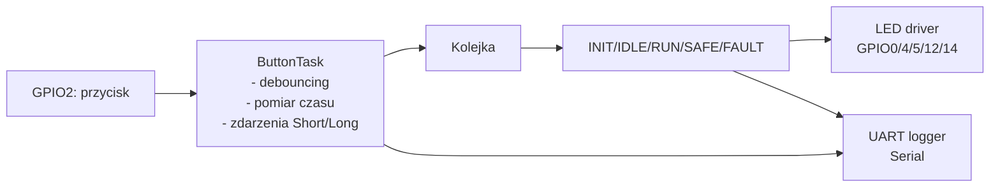
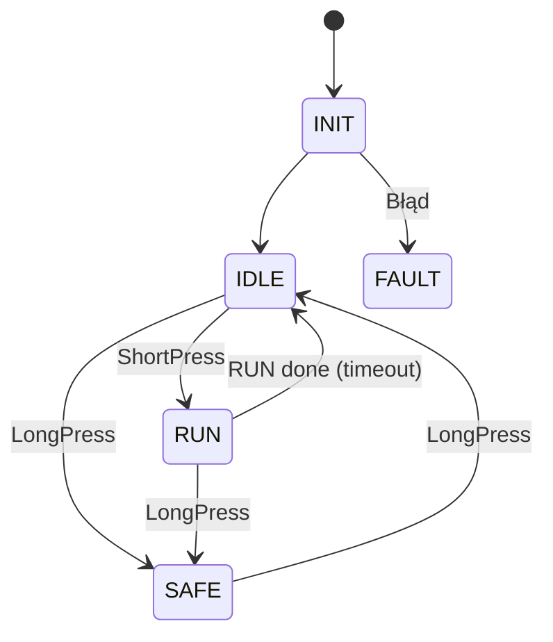

# Architektura

Projekt jest symulowany w Wokwi + PlatformIO, składa się z:
- ESP32/Arduino (board-esp32-devkit-c-v4)
- 5 x LED (wokwi-led)
- przycisk (wokwi-pushbutton)

Kod źródłowy stworzony za pomocą języka C++.

## Diagram blokowy

## Warstwy

- **main.cpp**
  - inicjalizacja peryferiów: `uart_init(115200)`, `button_pin_init()`, `led_pin_init()`
  - start RTOS: `task_begin()`

- **app (logika)**
  - `fsm_init()` – główna pętla sterowania i decyzje stanów
  - `task_begin()` – tworzenie kolejki zdarzeń i uruchomienie tasków

- **drivers (HAL)**
  - `button.cpp` – debouncing + klasyfikacja naciśnięć, wysyłanie `ButtonEvent` do kolejki
  - `led.cpp` – ustawienia pinów i wyjść (main/pedestrian)
  - `uart.cpp` – wrapper na `Serial` z mutexem dla logów

## IO: mapowanie pinów

Zgodne z `wokwi/diagram.json` oraz `include/*.h`:

- Przycisk: `GPIO2` (INPUT_PULLUP)
- Światła główne: czerwony `GPIO5`, żółty `GPIO4`, zielony `GPIO0`
- Światła pieszych: czerwony `GPIO14`, zielony `GPIO12`

## FSM

### Stany

`FsmState`:

- `INIT` — start FSM
- `IDLE` — normalny cykl świateł głównych, piesi stale na czerwonym
- `RUN` — sekwencja dla pieszych (krótkie naciśnięcie)
- `SAFE` — miganie żółtym (długie naciśnięcie przełącza SAFE↔IDLE)
- `FAULT` — stan awaryjny (wszystko wyłączone)

### Zdarzenia

- `ButtonEventType::ShortPress` — naciśnięcie krótsze niż 3000 ms
- `ButtonEventType::LongPress` — naciśnięcie co najmniej 3000 ms
- Timeouty faz (czas na podstawie ticków FreeRTOS)

### Graf przejść

### Warunki przejść

| Z | Do | Warunek |
|---|----|---------|
| INIT | IDLE | inicjalizacja zakończona (start FSM task) |
| IDLE | RUN | ShortPress (krótkie wciśnięcie przycisku) |
| RUN | IDLE | sekwencja RUN zakończona (timeout) |
| IDLE/RUN | SAFE | LongPress (>= 3000 ms) |
| SAFE | IDLE | LongPress (>= 3000 ms) |
| * | FAULT | błąd krytyczny (np. brak kolejki zdarzeń / brak utworzenia taska) |

### Akcje i czasy

Czasy są zdefiniowane w `src/app/fsm.cpp`:

- `IDLE` (faza świateł głównych):
  - `RED` 3000 ms → `YELLOW1` 1000 ms → `GREEN` 3000 ms → `YELLOW2` 2000 ms → `RED` ...
  - piesi w IDLE: czerwone cały czas

- `RUN` (faza świateł pieszych):
  - piesi `RED` 3000 ms → piesi `GREEN` 3000 ms → powrót do `IDLE`
  - światła główne w RUN: czerwone

- `SAFE`:
  - miganie żółtym co 400 ms (`GPIO4`), piesi wyłączone

- `FAULT`:
  - wszystkie LED wyłączone, pętla z opóźnieniem 200 ms

### Telemetria

FSM sumuje czas spędzony w stanach `IDLE/RUN/SAFE` i loguje przy wyjściu ze stanu (np. `SYS: Exited IDLE, total time: ... ms`).

## UART

### Stan aktualny w kodzie

- UART jest używany jako kanał **logów**: `uart_log_line()`, `uart_log_int()`.